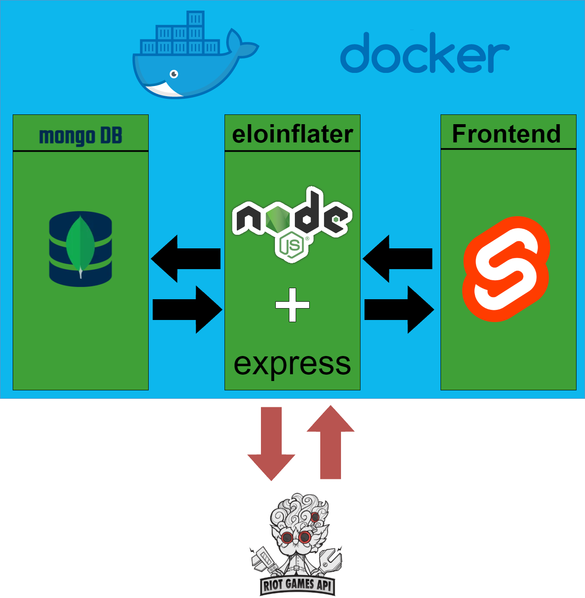

# **Eloinflater - Backend**

This project is a NodeJS Backend RESTful. The main purpose of this backend is to provide and curate Data from the Riot Games API for the game League of Legends. This Backend mainly tracks Summoners, their current rank and LP as well their played matches.

## Table of Contents

- [Overview](#Overview)
- [Getting started](#Getting-started)
  - [Installation](#Installation)
  - [Docker](#Docker-Image)
  - [Environment variables](#Environment-variables)
    - [Required](#Required-Environment-Variables)
      - [Optional](#Optional-Environment-Variables)
  - [Running the Backend](#Running-the-Backend)
    - [Local](#Local)
    - [Docker](#Docker)
    - [Docker-Compose](#Docker-Compose)

## Overview

This project is one of 3 parts needed to accumulate and curate summoner data. The following diagram shows the full architecture on a higher level:

## Getting started

### Installation

In order to run the Eloinflater Backed locally on your machine you need to clone the repository locally. To accomplish this use the command:

`git clone https://github.com/SandroSpengler/EloInflaterBackend.git`

After cloning the repository you'll need to **install all required npm** packages. This project was created with [**Yarn**](https://classic.yarnpkg.com/lang/en/docs/install/#windows-stable) but [npm](https://docs.npmjs.com/cli/v6/commands/npm-install) and [pnpm](https://pnpm.io/installation) should work too.

### Docker-Image

An up to date and publicly available Docker-Image is stored on [Dockerhub](https://hub.docker.com/r/sandrospengler/eloinflater/tags). Images are build for the Linux operating system and will require [WSL](https://learn.microsoft.com/en-us/windows/wsl/install) on Windows to run properly. To pull the image use the following command:

`docker pull sandrospengler/eloinflater:<VersionTag>`

### Environment variables

In order to run the Backend a few environment variables are required:

#### Required Environment Variables

- **DB_CONNECTION**
  The connection string for a MongoDB
- **PORT**
  The port on which the backend is running

#### Optional Environment Variables

- **API_Key**
  The Riot Games API-Key for requesting data
- **NODE_ENV**
  The environment that the backend is deployed on can be **_development_**, _test_ or **_production_**
- **RUN_JOB**
  Tells the server to automatically refresh summoner data can be **_start_** or **_stop_**

If the backend will **run locally**, then you will need to create a .env file inside the backend directory and set the environment variables.

Should you choose to **run the Docker-Image** then you will need to pass the environment variables inside the **docker run** statement.

### Running the Backend

#### Local

#### Docker

#### Docker-Compose
